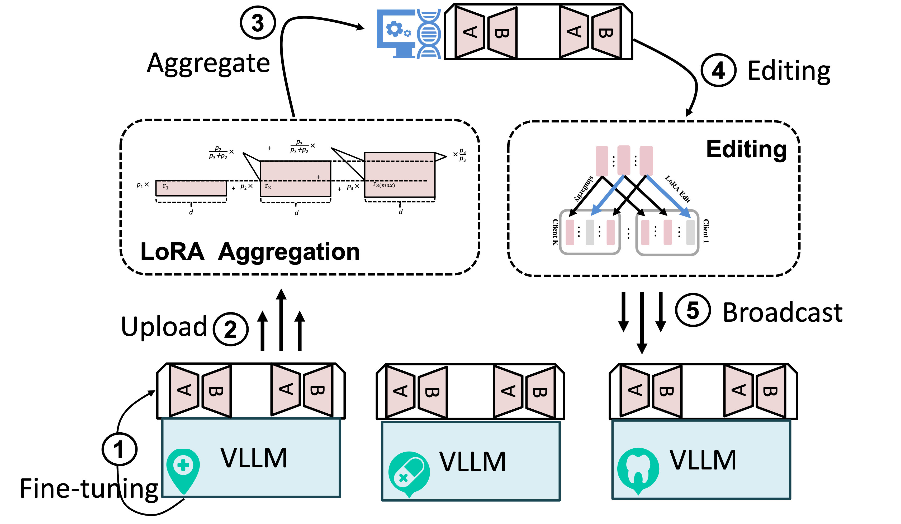
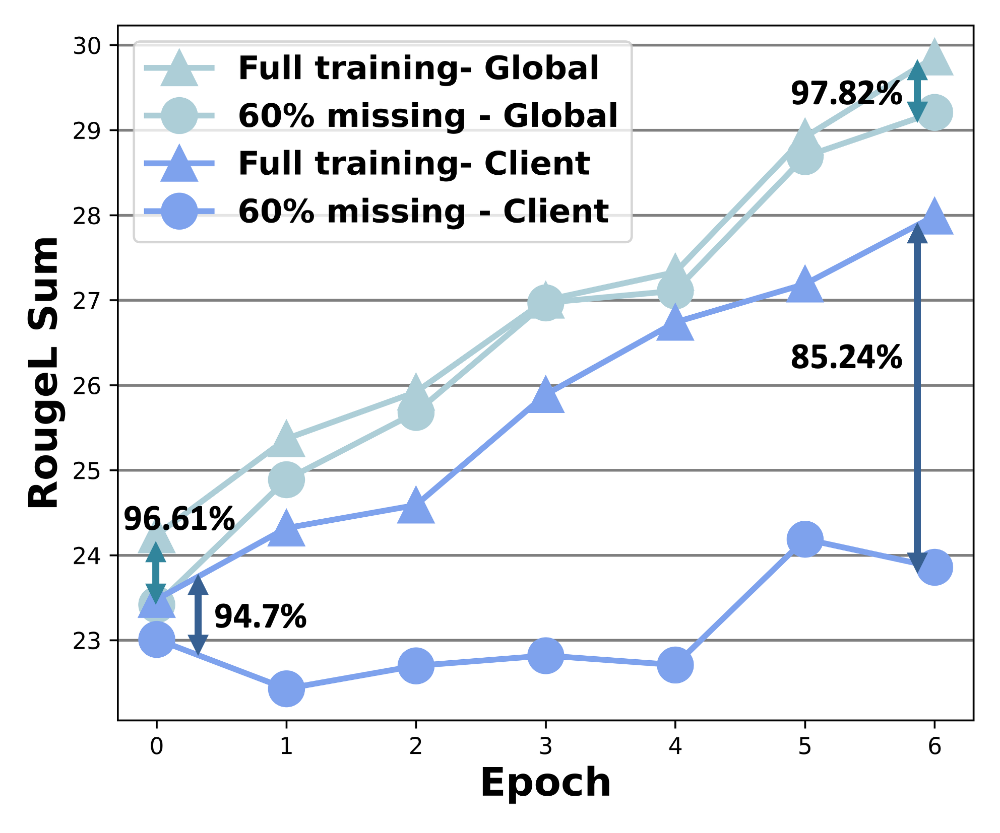
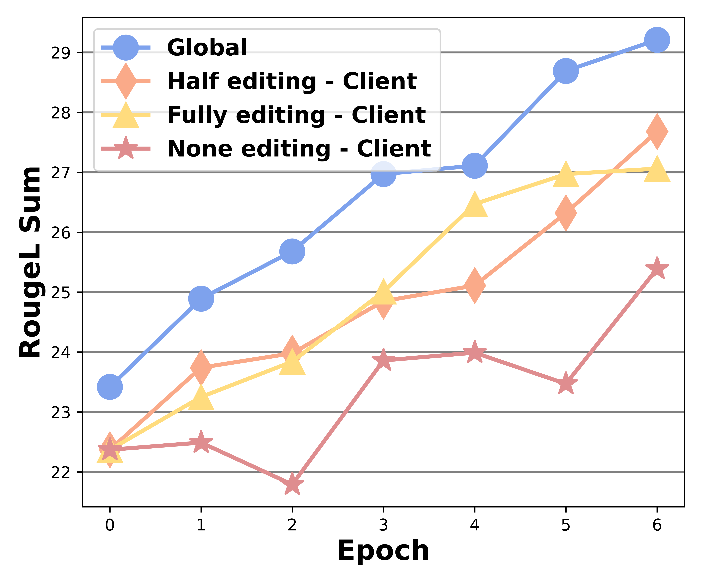

# FediLoRA: Heterogeneous LoRA for Federated Multimodal Fine-tuning under Missing Modalities


> **Accepted by IJCAI 2026 AI and Health track. This repository is keeping updating... Please feel free to email lishan.yang@adelaide.edu.au or wei.e.zhang@adelaide.edu.au**

<p align="center">
  
</p>

<p align="center">
  
  
</p>

## IJCAI 2026 Announcement

FediLoRA has been accepted by IJCAI 2026. Thanks to all collaborators, reviewers, and the open-source community supporting federated multimodal learning research.

This repository contains the code for **FediLoRA: Heterogeneous LoRA for Federated Multimodal Fine-tuning under Missing Modalities**. The paper studies federated fine-tuning for multimodal foundation models when clients have different compute budgets and incomplete modalities. FediLoRA introduces heterogeneous LoRA ranks, dimension-wise aggregation for LoRA updates, and lightweight layer-wise model editing to improve both global and personalized performance under missing text or image information.

## Contributions

- Supports federated multimodal fine-tuning with heterogeneous client LoRA ranks.
- Handles missing modalities in client data, including missing image or text-side information.
- Implements FediLoRA, HetLoRA, and Flora-style baselines for controlled comparison.
- Provides training and evaluation workflows for LLaVA-style multimodal instruction data.

## Repository Structure

```text
.
├── datasetter/          # LLaVA-style Dataset and data collator
├── evaluation/          # LLaVA evaluation and metric implementations
├── fed_utils/           # Federated clients, server, aggregation, and scheduling
├── llava/               # LLaVA model, serving, and evaluation utilities
├── paper_materials/     # Paper figures used in this README
├── preprocess/          # Dataset conversion and missing-modality generation
├── scripts/             # Example experiment launch scripts
├── vllm.py              # Main federated multimodal fine-tuning entry
├── requirements.txt     # pip environment
└── environment.yml      # conda environment
```

## Environment

Create the environment with either conda or pip:

```bash
conda env create -f environment.yml
conda activate flora
```

or:

```bash
pip install -r requirements.txt
```

The default multimodal backbone is `llava-hf/llava-1.5-7b-hf`. Make sure your machine has enough GPU memory for the chosen client count, LoRA rank setting, and batch size.

## Dataset Download

Download one or more supported datasets from Hugging Face:

- LLaVA-ReCap-118K: https://huggingface.co/datasets/lmms-lab/LLaVA-ReCap-118K
- IAM Sentences LLaVA JSON: https://huggingface.co/datasets/alpayariyak/IAM_Sentences_LLaVA_json
- SciCap Instruct LLaVA: https://huggingface.co/datasets/alexshengzhili/scicap-instruct-llava
- Program-CoTA LLaVA: https://huggingface.co/datasets/Salesforce/program-cota-llava
- LLaVA-CoT-Instruct-58K: https://huggingface.co/datasets/BUAADreamer/LLaVA-CoT-Instruct-58K

Place converted datasets under a directory such as `data_recaps/`. The expected structure is:

```text
data_recaps/
└── <num_clients>/
    ├── train/
    │   └── <client_id>.json
    ├── test/
    │   └── <client_id>.json
    └── missing/
        └── <missing_rate>/
            └── <client_id>.json
```

Each client JSON should follow the LLaVA conversation format:

```json
[
  {
    "sid": 0,
    "id": "000000000322",
    "image": "/path/to/images/000000000322.jpg",
    "conversations": [
      {
        "from": "human",
        "value": "<image>"
      },
      {
        "from": "gpt",
        "value": "A natural-language description or answer for the image."
      }
    ]
  }
]
```

## Data Preprocessing

Use the scripts in `preprocess/` to convert raw datasets and create missing-modality indexes. Adjust input and output paths inside the relevant preprocessing file before running:

```bash
python preprocess/recap.py
python preprocess/missing.py
```

Other dataset converters are available in `preprocess/next.py`, `preprocess/sam.py`, `preprocess/scienceqa.py`, and `preprocess/mind2web.py`.

## Training

Run FediLoRA on a 10-client ReCap split:

```bash
python vllm.py \
    --global_model llava7b \
    --data_path data_recaps \
    --output_dir llava-recaps-10/ \
    --num_communication_rounds 8 \
    --local_num_epochs 1 \
    --local_batch_size 32 \
    --local_micro_batch_size 2 \
    --num_clients 10 \
    --heter True \
    --algo fedilora \
    --mini False \
    --missing_rate 0.4 \
    --client_selection_frac 0.4 \
    --train_subrate 0.3 \
    --test_parts 5
```

Switch `--algo` among:

- `fedilora`
- `hetlora`
- `flora`

For a lightweight smoke test:

```bash
bash scripts/test.sh
```

Additional launch examples are provided in `scripts/recaps.sh`, `scripts/next.sh`, `scripts/sam.sh`, and `scripts/per.sh`.

## Citation

Paper: https://arxiv.org/abs/2509.06984

```bibtex
@misc{yang2025fedilora,
  title        = {FediLoRA: Heterogeneous LoRA for Federated Multimodal Fine-tuning under Missing Modalities},
  author       = {Lishan Yang and Wei Emma Zhang and Nam Kha Nguygen and Po Hu and Yanjun Shu and Weitong Chen and Mong Yuan Sim},
  year         = {2025},
  eprint       = {2509.06984},
  archivePrefix = {arXiv},
  primaryClass = {cs.LG},
  url          = {https://arxiv.org/abs/2509.06984}
}
```
